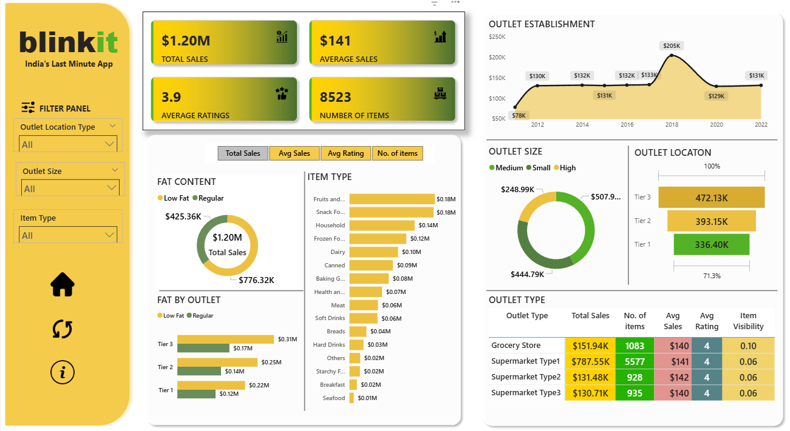

# 👋 Hi, I’m **Prasang Jain**
**Entry-Level Data Analyst**  
Turning raw data into meaningful insights using Python, SQL, Power BI & Excel.

📍 India  
📫 Email: mejainprasang43@gmail.com  
🔗 [LinkedIn](https://www.linkedin.com/in/prasang-jain-17a378212/) | [GitHub](https://github.com/jain-prasang3010) |📄[Resume](https://drive.google.com/drive/folders/1Cxvw3bJF74NxQaMg49ugJ3k8XVUmKn3h)  

---

## 💼 About Me

I am a B.Tech Computer Science graduate and aspiring Data Analyst with strong hands-on experience in data cleaning, exploratory data analysis, SQL querying, and building interactive dashboards.

I enjoy working with messy datasets, finding patterns, and converting numbers into clear business stories. Through multiple real-world projects, I have applied analytical thinking to solve business problems such as improving sales visibility, understanding customer behavior, and identifying employee attrition trends.

Currently seeking **Entry-Level Data Analyst / Business Analyst** roles where I can contribute with strong problem-solving skills, attention to detail, and a passion for data-driven decision making.

---

## 🧠 What I Can Do

- Clean and preprocess raw datasets  
- Perform Exploratory Data Analysis (EDA)  
- Write complex SQL queries  
- Build interactive dashboards and reports  
- Translate business questions into analytical solutions  
- Communicate insights through visual storytelling  

---

## 🔧 Technical Skills

**Programming & Analysis**  
- Python (Pandas, NumPy)  
- SQL (MySQL, PostgreSQL)

**Visualization Tools**  
- Power BI  
- Microsoft Excel (Pivot Tables, Charts, VLOOKUP, XLOOKUP)

**Analytics Concepts**  
- Data Cleaning  
- Exploratory Data Analysis (EDA)  
- Descriptive Statistics  
- Trend Analysis  
- KPI Tracking  

**Soft Skills**  
- Analytical Thinking  
- Problem Solving  
- Communication  
- Attention to Detail  
- Time Management  

---

## 📊 Featured Projects

---

### 📌 Blinkit Sales Performance Dashboard  
**Tools:** Power BI, Excel  

**Problem:**  
Blinkit needed a clear view of sales performance, product categories, and revenue trends.

**What I Did:**  
- Cleaned and structured raw sales data  
- Created interactive Power BI dashboard  
- Built KPIs for total sales, orders, and revenue  
- Analyzed product-wise and category-wise performance  

**Key Insights:**  
- Identified top-performing categories contributing ~40% of total sales  
- Highlighted monthly sales growth and decline patterns  
- Revealed underperforming products for improvement  

**Outcome:**  
Improved visibility into sales trends and enabled faster business decisions.
## 📸 Dashboard Preview

🔗 [Project Repo](https://github.com/jain-prasang3010/blinkitAnalysis) | [Live Demo](https://github.com/jain-prasang3010/blinkitAnalysis/blob/main/Final%20Dashbord%20Blinkit%20Analysis.png)

---

### 📌 Netflix Movies & TV Shows Dashboard  
**Tools:** Power BI, Excel  

**Problem:**  
Netflix needs an interactive and visual way to understand content distribution, popular genres, and growth trends across movies and TV shows.

**What I Did:**  
- Cleaned and prepared the Netflix dataset in Excel  
- Imported dataset into Power BI  
- Built interactive dashboard with slicers and filters  
- Created visuals for Movies vs TV Shows, Genres, Release Trends, and Country-wise content  

**Key Insights:**  
- Movies account for the majority of Netflix titles  
- Drama and International content are the most dominant genres  
- Strong increase in content releases after 2015  
- USA and India contribute the highest number of titles  

**Outcome:**  
Delivered an interactive Power BI dashboard supporting data-driven content strategy decisions.
## 📸 Dashboard Preview

🔗 [Project Repo](https://github.com/jain-prasang3010/Netflix-Movies-and-TV-Shows-Dashboard-Public) | [Live Demo](https://github.com/jain-prasang3010/Netflix-Movies-and-TV-Shows-Dashboard-Public/blob/main/Netflix%20Movies%20and%20TV%20Shows%20Dashboard%20-%20by%20Prasang%20Jain.png)

---

### 📌 HR Analytics Dashboard  
**Tools:** SQL, Power BI  

**Problem:**  
High employee attrition without clear reasons.

**What I Did:**  
- Queried employee data using SQL  
- Designed Power BI dashboard  
- Analyzed attrition by department, age, salary, and job role  

**Key Insights:**  
- Higher attrition among employees with low salary bands  
- Certain departments show consistently higher turnover  

**Outcome:**  
Helped HR teams identify focus areas for retention.
## 📸 Dashboard Preview

🔗 [Project Repo](https://github.com/jain-prasang3010/hr_Analysis) | [Live Demo](https://github.com/jain-prasang3010/hr_Analysis/blob/main/Dashboard.png)

---

## 📂 Additional Practice Work

- SQL Practice Queries  
- Excel Data Cleaning Exercises  
- Python EDA Notebooks  

---

## 🎓 Education

**B.Tech in Computer Science**  
University Name | Year  

---

## 📜 Certifications

- Google Data Analytics Certificate  
- SQL for Data Analysis – LinkedIn Learning  
- Power BI Data Visualization – Microsoft  

---

## 🚀 Career Objective

To secure an entry-level Data Analyst role where I can apply analytical skills, learn from real-world business problems, and grow as a data professional.

---

## 📫 Let’s Connect

📫 Email: mejainprasang43@gmail.com  
🔗 [LinkedIn](https://www.linkedin.com/in/prasang-jain-17a378212/) | [GitHub](https://github.com/jain-prasang3010)  
